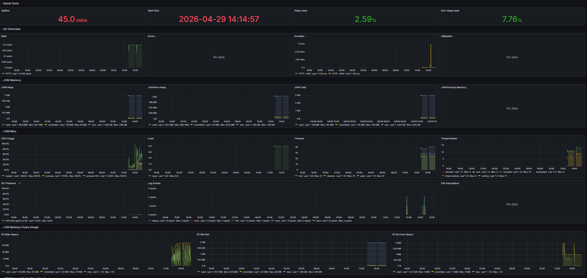
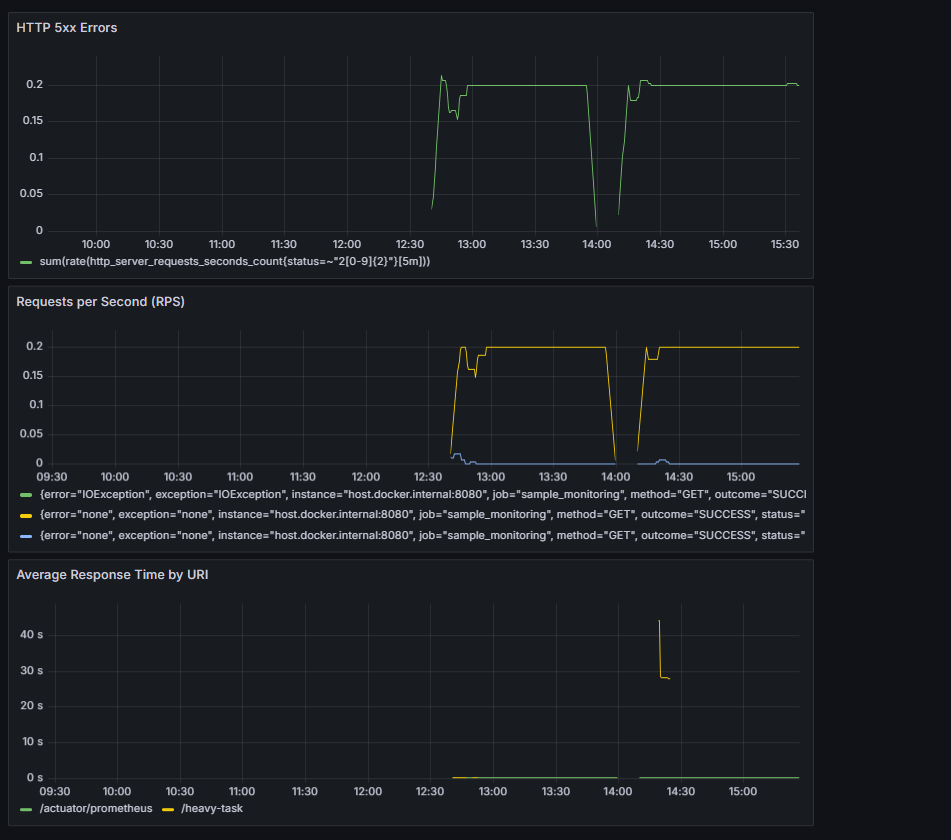

# Thread Dump Analysis

Анализ выполнен по файлу `threads.txt`.

Формула расчета нагрузки потока:

`CPU % = (cpu_ms / 1000) / elapsed_s * 100`

## Top-3 нагруженных потока

| # | Поток | CPU, ms | Elapsed, s | Нагрузка, % | Состояние | Интерпретация |
|---|---|---:|---:|---:|---|---|
| 1 | `http-nio-8080-exec-3` | 274484.38 | 336.34 | 81.61% | `RUNNABLE` | Активно выполняет BCrypt в `BookService.heavyTaskForDuration()` при обработке `/heavy-task`. |
| 2 | `http-nio-8080-exec-9` | 239906.25 | 336.34 | 71.33% | `RUNNABLE` | Активно выполняет BCrypt в `BookService.heavyTaskForDuration()` при обработке `/heavy-task`. |
| 3 | `http-nio-8080-exec-4` | 52328.12 | 336.34 | 15.56% | `WAITING` | Существенная CPU-нагрузка была накоплена ранее; в момент снятия дампа поток уже ожидает задачу в очереди Tomcat. |

## Вывод

Основная нагрузка создается Tomcat worker-потоками, которые обслуживают запросы к `/heavy-task`.
В двух самых нагруженных потоках стек прямо указывает на `BCryptPasswordEncoder.encode()` и `BookService.heavyTaskForDuration()`, то есть CPU расходуется именно на искусственную тяжелую задачу.

## Мониторинг (Prometheus & Grafana)

Для мониторинга сервиса развернута инфраструктура в Docker (Prometheus + Grafana).  
Метрики собираются через Spring Boot Actuator и Micrometer.

### Скриншоты дашбордов

1. **Общий дашборд JVM (Micrometer)**  
   Отображает общее состояние системы: загрузку Heap, активность GC и количество потоков.

2. **Кастомный дашборд сервиса**  
   Отображает специфичные метрики производительности нашего API.

### Используемые PromQL запросы

| Панель | Запрос | Описание |
|---|---|---|
| Average Response Time | `sum by (uri) (rate(http_server_requests_seconds_sum[5m])) / sum by (uri) (rate(http_server_requests_seconds_count[5m]))` | Вычисляет среднее время ответа для каждого эндпоинта. На графике виден пик ~25с при вызове `/heavy-task`. |
| Requests per Second | `rate(http_server_requests_seconds_count[5m])` | Показывает интенсивность входящего трафика (количество запросов в секунду). |
| HTTP 5xx Errors | `sum(rate(http_server_requests_seconds_count{status=~"5[0-9]{2}"}[5m]))` | Отслеживает количество серверных ошибок. Позволяет быстро заметить деградацию сервиса. |